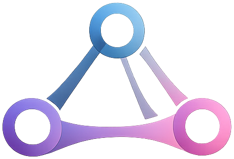
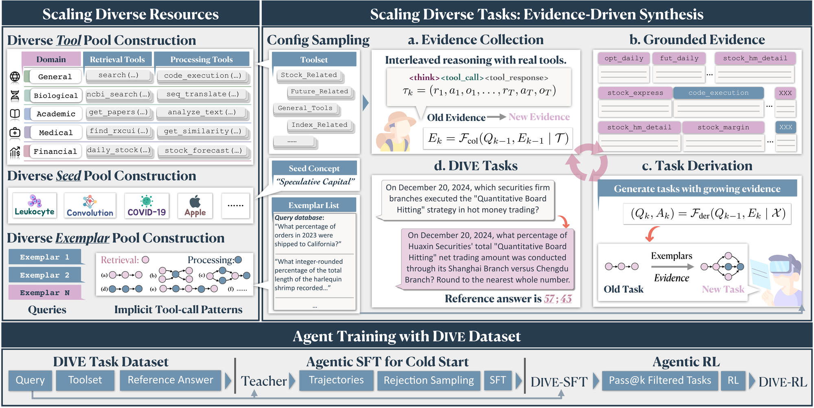

<div align="center">

</div>

# DIVE: Scaling Diversity in Agentic Task Synthesis for Generalizable Tool Use

<div align="center">

<a href="#"></a>
<a href="https://sheep333c.github.io/DIVE/"></a>
<a href="https://huggingface.co/dive-team"></a>

Aili Chen<sup>♠♣</sup>, Chi Zhang<sup>♣</sup>, Junteng Liu<sup>♣</sup>, Jiangjie Chen<sup>♦</sup>, Chengyu Du<sup>♠♣</sup>, Yunji Li<sup>♣</sup>, Ming Zhong<sup>♣</sup>, Qin Wang<sup>♣</sup>, Zhengmao Zhu<sup>♣</sup>, Jiayuan Song<sup>♣</sup>, Ke Ji<sup>♣</sup>, Junxian He<sup>♣</sup>, Pengyu Zhao<sup>♣</sup>, Yanghua Xiao<sup>♠†</sup>

<sup>♠</sup> Fudan University &nbsp;&nbsp; <sup>♣</sup> MiniMax &nbsp;&nbsp; <sup>♦</sup> Independent

📧 {alchen20, shawyh}@fudan.edu.cn

</div>

DIVE — an evidence-driven recipe that synthesizes **Di**verse, **V**erifiable, and **E**xecutable agentic tasks by inverting synthesis order: executing diverse, real-world tools first and reverse-deriving tasks from the resulting traces. Training Qwen3-8B on DIVE data yields **+22** avg points across 9 OOD benchmarks.

<p align="center">

</p>

## Updates

- 2026/03: Release code, data, and model for DIVE.

## Data & Model

You can download our dataset and model from [🤗 HuggingFace](https://huggingface.co/dive-team).

| Resource | Link |
|----------|------|
| DIVE-SFT-20K | [🤗 dive-team/DIVE-SFT-20K](https://huggingface.co/datasets/dive-team/DIVE-SFT-20K) |
| DIVE-8B-RL | [🤗 dive-team/DIVE-8B-RL](https://huggingface.co/dive-team/DIVE-8B-RL) |

## Installation

```bash
conda create -n dive python=3.10
conda activate dive
pip install -e .

# Optional: domain-specific tool dependencies
pip install -e ".[all-tools]"
```

## Quick Start

### Configure

```bash
cp dive.example.yaml dive.yaml
# Fill in your API keys and model settings
```

See `dive.example.yaml` for the full config schema. Each pipeline stage (synthesizer / solver / verifier) can use a different LLM provider (`anthropic` or `openai_compatible`).

### Synthesize tasks only

```bash
dive --config dive.yaml synthesize --domain medical --count 10 --workers 4
```

### Full pipeline (synthesize → solve → verify → aggregate)

```bash
dive --config dive.yaml end2end \
  --domain medical \
  --count 100 \
  --workers 10 \
  --batch_size 20
```

## Project Structure

```
DIVE/
├── dive/                   # Core package
│   ├── cli.py              # CLI entry point
│   ├── llm.py              # LLM client (Anthropic + OpenAI-compatible)
│   ├── synthesizer.py      # Evidence collection + task derivation
│   ├── solver.py           # Task solving (trajectory generation)
│   ├── verifier.py         # Trajectory verification
│   ├── aggregator.py       # Result aggregation
│   └── tool_runner.py      # Tool registry & execution
├── tools/                  # 373 domain-specific tool implementations
├── data/                   # Seeds, exemplars, tool mappings
├── tests/
├── dive.example.yaml
└── pyproject.toml
```

## Contact

If you have any problems, please contact [Aili Chen](mailto:xxx@xxx.edu).

## Citation

If our paper or related resources prove valuable to your research, we kindly ask for a citation.

```bibtex
@inproceedings{chen2026dive,
  title={{DIVE}: Scaling Diversity in Agentic Task Synthesis for Generalizable Tool Use},
  author={},
  booktitle={},
  year={2026}
}
```
